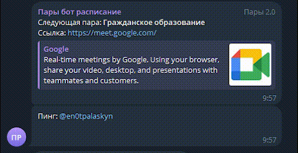

# 📅 College Schedule Telegram Bot

> Telegram-бот для автоматической рассылки расписания пар студентам колледжа.  
> Использует Redis для кэширования данных и Docker для контейнеризации.

---

## 🚀 Демонстрация


---

## 🧠 Возможности
✅ Рассылка пар по времени  
✅ Команды `/para` [`None`, `all`, `next`], `/cancel`, `/pingme`, `/pingwho`  
✅ Загрузка данных из JSON в Redis  
✅ Асинхронная логика через `asyncio`  
✅ Полная поддержка Docker и Compose  

---

## 🗂️ Структура проекта
```text
project/
│
├── code/
│   ├── Bot.py
│   ├── System.py
│   ├── DataBase.py
│   ├── Debug.py
│
├── data/
│   ├── Config.json
│   ├── Schedule.json
│   ├── lessons.json
│   ├── Url.json
│   ├── Ping.json
│
├── docker-compose.yml
├── Dockerfile
├── requirements.txt
└── README.md
```

---

## ⚙️ Установка и запуск

### 1️⃣ Локальный запуск
```bash
pip install -r requirements.txt
python main.py
```

### 2️⃣ Docker
```bash
docker compose up --build
```

---

## 🧩 Технологии
- Python 3.13  
- Aiogram 3  
- Redis  
- Docker / Docker Compose  
- Rich (логирование)

---

## 📚 Документация
- [Описание кода](/docs/code_description.md)
- [Описание данных](/docs/data_description.md)

---

## 👤 Автор
**Enotkiller**  
> Telegram: [@en0tpalaskyn](https://t.me/en0tpalaskyn)  
> GitHub: [github.com/Enotkiller](https://github.com/Enotkiller)

---

## 🏷️ Лицензия
[MIT License © 2025 Enotkiller](/LICENSE)
